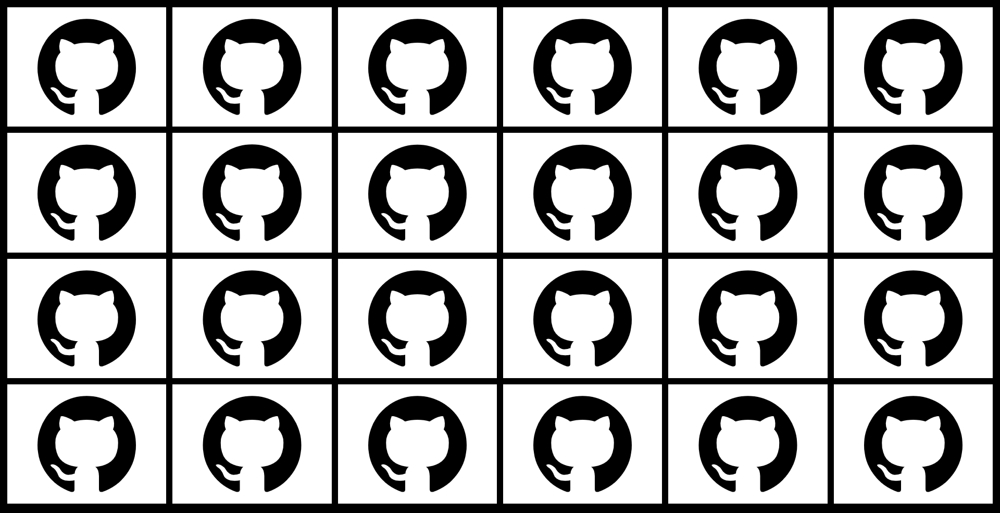
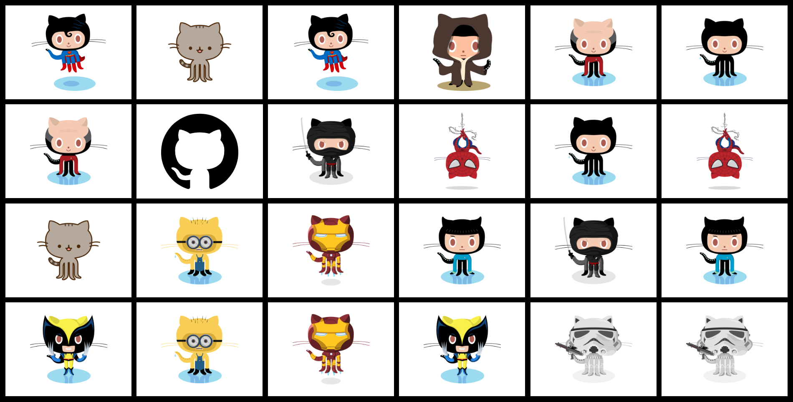

# ProjectMnemosyne
A simple Octocat themed Memory Game :)
* To play - [link](https://justyouraverageonion.github.io/ProjectMnemosyne/Mnemosyne.html)

## Preview

## Assets
* Images - [link](https://octodex.github.com/)
* Fisher-Yates Algorithm - [link](https://bost.ocks.org/mike/shuffle/)
